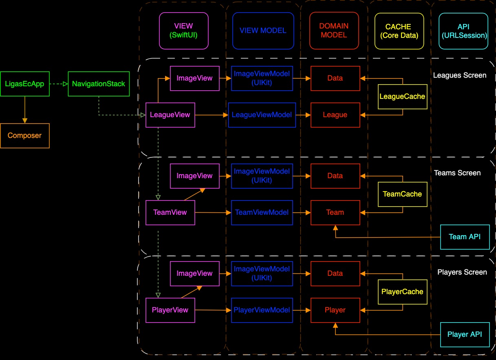
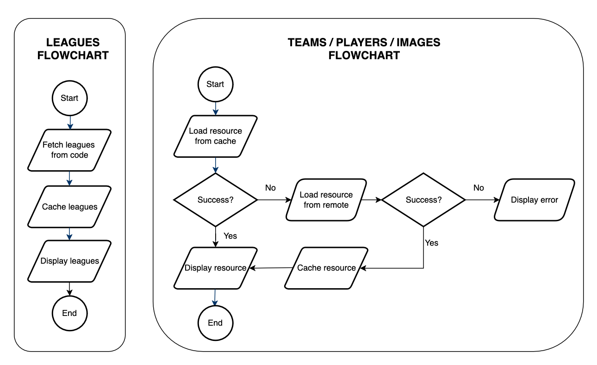

# LigasEc 


## App Architecture



---

## Data Flowchart



---

## Leagues Feature Specs

### Story: Customer requests to see Ecuadorian leagues

### Narrative

```
As an online/offline customer
I want the app to show ecuadorian leagues
So I can choose one of them 
```

#### Scenarios (Acceptance criteria)

```
Given an online/offline customer
 When the customer requests to see the leagues
 Then the app should display hardcoded leagues
  And save those leagues to cache 
  And if saving fails, delete the cache
  
Given an online/offline customer
  And there's a cached version of the leagues
 When the customer requests to see the leagues
 Then the app should display hardcoded leagues
  And don't save those leagues to cache
```

## Use Cases

### Load Leagues Use Case

#### Data:
- Hardcoded leagues

#### Primary course (happy path):
1. System creates leagues from hardcoded data.
2. System shows leagues.

---

### Load League Image From Remote Use Case

#### Data:
- URL

#### Primary course (happy path):
1. Execute get command.
2. System downloads data from the URL.
3. System validates downloaded data.
4. System delivers image data.

#### Cancel course:
1. System does not deliver image data nor error. (To Implement)

#### Any error – error course (sad path):
1. System delivers respective error.

---

### Load League Image From Local Use Case

#### Data:
- URL

#### Primary course (happy path):
1. Execute load command.
2. System retrieves data from the cache.
3. System delivers cached image data.

#### Cancel course:
1. System does not deliver image data nor error. (To Implement)

#### Retrieval error course (sad path):
1. System delivers error.

#### Empty cache course (sad path):
1. System delivers not found error.

---

### Save League Image To Local Use Case

#### Data:
- Image Data

#### Primary course (happy path):
1. Execute save command.
2. System caches image data.

#### Saving error course (sad path):
1. System delivers error.

---

### Save Leagues To Local Use Case

#### Data:
- League

#### Primary course (happy path):
1. Execute save command.
3. System encodes leagues.
4. System timestamps the new cache.
5. System saves new cache data.

#### Saving error course (sad path):
1. System deletes cache.

#### Saving and deleting cache error course (sad path):
1. System delivers error.
---

### Validate League Cache Use Case

#### Primary course:
1. Execute "Validate Cache" command upon app launch.
2. System retrieves leagues data from cache.
3. System validates cache is less than seven days old.

#### Retrieval error course (sad path):
1. System deletes cache.

#### Expired cache course (sad path): 
1. System deletes cache.

---

## League Model Spec

### League

| Property      | Type                |
|---------------|---------------------|
| `id`          | `String`            |
| `name`        | `String`            |
| `logoURL`     | `URL`               |
| `dataSource`  | `DataSource`        |


---


## Teams Feature Specs

### Story: Customer requests to see teams of a selected league

### Narrative #1

```
As an online customer
I want the app to load teams of a selected ecuadorian league
So I can choose one of them
```

#### Scenarios (Acceptance criteria)

```
Given the customer has connectivity
  And the cache is empty
 When the customer requests to see teams of a league
 Then the app should display all teams from remote
  And save those teams to cache

Given the customer has connectivity
  And there's a cached version of the teams
 When the customer requests to see teams of a league
 Then the app should display all teams from cache
```

### Narrative #2

```
As an offline customer
I want the app to load teams of a selected ecuadorian league
So I can choose one of them
```

#### Scenarios (Acceptance criteria)

```
Given the customer doesn't have connectivity
  And the cache is empty
 When the customer requests to see the teams
 Then the app should display an error message 
 
Given the customer doesn't have connectivity
  And there's a cached version of the teams
 When the customer requests to see the teams
 Then the app should display the teams from cache
```

## Use Cases

### Load Teams From Local Use Case

#### Data:
- URL

#### Primary course (happy path):
1. Execute load command.
2. System retrieves data from the cache.
3. System delivers teams.

#### Load empty data with succesfull remote (sad path): //TODO: Review
1. Execute load command.
2. System gets empty data.
3. Execute get command from remote.
4. System retrieves data from remote
5. System delivers teams.

#### Load empty data with failing remote (sad path):
1. Execute load command.
2. System gets empty data.
3. Execute get command from remote.
4. System retrieves data from remote
5. System delivers error.

#### Load error course with successfull remote (sad path):
1. Execute load command.
2. System delivers error.
3. Execute get command from remote.
4. System retrieves data from remote
5. System delivers teams.

#### Load error course with failing remote (sad path):
1. Execute load command.
2. System delivers error.
3. Execute get command from remote.
4. System retrieves data from remote
5. System delivers error.
---

### Save Teams To Local Use Case

#### Data:
- Team

#### Primary course (happy path):
1. Execute save command.
2. System saves new cache data with respective id.

#### Saving error course (sad path):
1. System delivers error.
---

## Team Model Specs

### Team

| Property          | Type                    |
|-------------------|-------------------------|
| `id`              | `String`                |
| `name`            | `String`                |
| `logoURL`         | `URL`                   |
| `dataSource`      | `DataSource`            |

---

## Players Feature Specs

### Story: Customer requests to see players of a selected team

### Narrative #1

```
As an online customer
I want the app to load players of a selected ecuadorian league team
So I can visualize basic information of squad 
```

#### Scenarios (Acceptance criteria)

```
Given the customer has connectivity
  And the cache is empty
 When the customer requests to see players of a team
 Then the app should display all players from remote
  And save those players to cache

Given the customer has connectivity
  And there's a cached version of the players
 When the customer requests to see players of a team
 Then the app should display all players from cache
```

### Narrative #2

```
As an offline customer
I want the app to load players of a selected ecuadorian team
So I can visualize basic information of squad 
```

#### Scenarios (Acceptance criteria)

```
Given the customer doesn't have connectivity
  And the cache is empty
 When the customer requests to see the players
 Then the app should display an error message 
 
Given the customer doesn't have connectivity
  And there's a cached version of the players
 When the customer requests to see the players
 Then the app should display players from cache
```

## Use Cases

### Load Players From Local Use Case

#### Data:
- URL

#### Primary course (happy path):
1. Execute load command.
2. System retrieves data from the cache.
3. System delivers players.

#### Load empty data with succesfull remote (sad path): //TOOD: Delete this
1. Execute load command.
2. System gets empty data.
3. Execute get command from remote.
4. System retrieves data from remote
5. System delivers players.

#### Load empty data with failing remote (sad path):
1. Execute load command.
2. System gets empty data.
3. Execute get command from remote.
4. System retrieves data from remote
5. System delivers error.

#### Load error course with successfull remote (sad path):
1. Execute load command.
2. System delivers error.
3. Execute get command from remote.
4. System retrieves data from remote
5. System delivers teams.

#### Load error course with failing remote (sad path):
1. Execute load command.
2. System delivers error.
3. Execute get command from remote.
4. System retrieves data from remote
5. System delivers error.
---

### Save Players To Local Use Case

#### Data:
- Player

#### Primary course (happy path):
1. Execute save command.
2. System saves new cache data with respective id.

#### Saving error course (sad path):
1. System delivers error.
---

## Player Model Specs

### Team

| Property          | Type                    |
|-------------------|-------------------------|
| `id`              | `String`                |
| `name`            | `String`                |
| `logoURL`         | `URL`                   |
| `dataSource`      | `DataSource`            |

---

//TODO: Implement apikey for workflow tests
